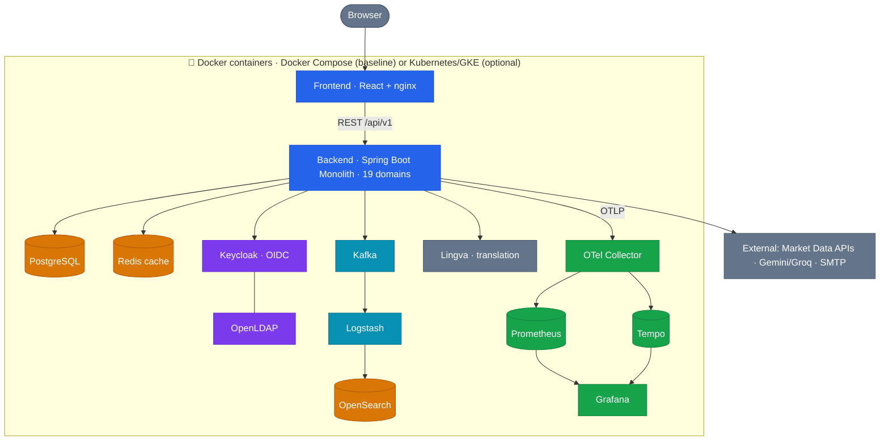

<div align="center">


# 32Bit Finance Portal

**Full-stack, multi-asset financial market tracking & portfolio management platform**

*Real-time market data · Portfolio · Price alarms · What-If simulation · AI assistant*


*Developed for the **Toyota & 32Bit Full-Stack Competition 2026***

**English** · [Türkçe](README.tr.md)

</div>

---

## Table of Contents

1. [Overview](#overview)
2. [Features](#features)
3. [Architecture](#architecture)
4. [Tech Stack](#tech-stack)
5. [Getting Started](#getting-started)
6. [Services and Ports](#services-and-ports)
7. [Default Credentials and Users](#default-credentials-and-users)
8. [API Documentation](#api-documentation)
9. [Authentication and Security](#authentication-and-security)
10. [Observability](#observability)
11. [Code Quality](#code-quality)
12. [Deployment](#deployment)
13. [Project Structure](#project-structure)
14. [Documentation](#documentation)
15. [Contact](#contact)
16. [License](#license)

---

## Overview

**32Bit Finance Portal** is a full-stack, multi-asset financial **market tracking and personal portfolio management** web application, built for the Toyota & 32Bit Full-Stack Competition 2026.

It aggregates near real-time data across **19 asset / data domains** — foreign exchange, bank & effective rates, crypto, commodities, Turkish gold, stocks (+ BIST & global indices), funds (TEFAS & global ETFs), bonds, Turkish bonds (DİBS), eurobonds, VİOP, futures, IPOs, Turkish & US economic indicators, the economic calendar, and financial news — from many external providers, and serves them with low latency through a sync-and-cache design.

On top of the data, it offers **portfolio tracking** (profit/loss in TL and %, allocation, transaction history), **watchlists**, **price alarms** (e-mail), **historical charts** with technical indicators and comparison, **simulation & What-If** analysis, an **AI assistant** (LLM tool-calling over the user's own data), and a **multi-language (TR/EN)**, **multi-theme** interface.

- **Backend:** modular-monolith **Spring Boot** (19 domain modules), layered architecture.
- **Frontend:** **React** SPA.
- **Identity:** **Keycloak** (OIDC, 2FA, role-based access, multi-layer ban).
- **Observability:** **OpenTelemetry** (metrics, traces, logs) → Prometheus / Tempo / Grafana / OpenSearch.
- **Deployable** locally via **Docker Compose** and in the cloud via **Kubernetes (GKE)**.

> ⚠️ **Disclaimer:** All market data is for **informational purposes only** and does **not** constitute investment advice.

---

## Features

**Market Data & Analysis**
- 19 asset/data domains (FX, bank rates, crypto, commodities, gold, stocks + indices, funds, bonds, eurobonds, VİOP, futures, IPO, TR/US economy, economic calendar, news)
- Historical price charts (candlestick/line) + technical indicator (moving average) + multi-asset comparison
- What-If & saved simulation scenarios
- Crypto Fear & Greed index, fundamentals (stocks & crypto)

**Personal**
- Multi (named) **portfolios** — current value, profit/loss (TL & %), allocation (pie chart), total return, transaction history
- **Watchlist** (live price + sparkline)
- **Price alarms** (ABOVE/BELOW, once/continuous) with e-mail notification
- **Saved charts** (drawings/overlays)
- **AI chat assistant** — LLM tool-calling over the user's portfolio/watchlist/alarms/prices

**Platform**
- News with **TR ↔ EN translation** (self-hosted Lingva)
- **Authentication & authorization** — Keycloak/OIDC, JWT, **2FA (TOTP)**, USER/ADMIN roles, **multi-layer ban**
- **Internationalization** (TR/EN) and **multi-theme** UI
- **Resilience** — scheduled sync + Redis cache + last-good/fallback values; LLM provider failover
- **Observability** — metrics, traces, logs (OpenTelemetry)
- **REST API** with `/api/v1` versioning, **OpenAPI/Swagger** & **Javadoc**, centralized error handling
- **Admin panel** — user management, ban, force-logout

---

## Architecture

Every component is packaged as a **Docker container** — the entire stack runs with a single `docker compose up` (the baseline deployment). **Kubernetes/GKE is an optional production deployment** that additionally provides an Ingress + TLS (cert-manager) and horizontal autoscaling (HPA). The backend is a modular-monolith Spring Boot app; market data is collected from external providers via scheduled jobs and served from a Redis cache.



> A detailed architecture (C4 levels, components, data model) is in the **[Technical Design Document (PDF)](docs/32_BIT_FinansPortal_TeknikAnalizDokumanı.pdf)**.

---

## Tech Stack

| Layer | Technologies |
|-------|--------------|
| **Frontend** | React 19, Vite, React Router, TanStack React Query, Axios, Tailwind CSS, i18next, KLineCharts / Lightweight-Charts / Recharts, Vitest |
| **Backend** | Java 21, Spring Boot 3.3 (Web, Data JPA, Security, OAuth2 Resource Server, Data Redis, Data LDAP, Data Elasticsearch, Mail), Flyway, MapStruct, Lombok, Log4j2, springdoc-openapi, Micrometer, jsoup |
| **Data & Infra** | PostgreSQL, Redis, Apache Kafka (+ Zookeeper), OpenSearch, Logstash, Keycloak (OIDC), OpenLDAP |
| **Observability** | OpenTelemetry (Java Agent), Prometheus, Tempo, Grafana |
| **AI & Translation** | Google Gemini, Groq (LLM), Lingva (self-hosted translation) |
| **DevOps & Quality** | Docker, Docker Compose, Kubernetes (GKE), cert-manager, GitHub Actions, SonarQube, JaCoCo, k6 |

---

## Getting Started

The entire stack (backend + frontend + all infrastructure) runs with a single Docker Compose command. Images for the backend and frontend are **built locally** from their Dockerfiles.

> **`<app_url>`** in the URLs below = your host — `http://localhost` for local Docker, or your deployed domain. The ports shown (`5173`, `8081`, …) are the **default** Docker Compose ports; remap them freely.

### Prerequisites

- **Docker** & **Docker Compose**
- **JDK 21** (only to build the Keycloak ban-authenticator plugin once)
- *(optional)* **Node.js 20+** — only if you want to run the frontend in dev mode outside Docker
- **Resources:** ~17 containers run (incl. OpenSearch & Kafka) — allocate Docker **≥ 8 GB RAM** and **~40 GB free disk** (Docker Desktop → Settings → Resources)

### Quick Start

```bash
# 1. Clone
git clone <repo-url>
cd finance_portal

# 2. Build the Keycloak ban-authenticator plugin (one time)
#    Linux/macOS: if you get "Permission denied", run `chmod +x mvnw` first
./mvnw -f keycloak-providers/ban-authenticator/pom.xml package

# 3. (Optional) create an .env file for API keys — see "Configuration" below
#    Without it, the app still runs; data sync / AI / e-mail features degrade gracefully.

# 4. Start the whole stack (builds backend + frontend, starts all services)
docker compose up -d

# 5. Open the app
#    Frontend : <app_url>:5173
#    Backend  : <app_url>:8081/api/v1
#    Swagger  : <app_url>:8081/api/v1/swagger-ui.html
```

### Keycloak Realm (auto-imported)

The Keycloak realm `finance-realm` — including roles, seeded users, and the **ban-check login flow** — is **imported automatically** on first startup. Docker Compose runs Keycloak with `--import-realm` and mounts the bundled, sanitized realm export ([`finance_portal/finance-realm.json`](finance_portal/finance-realm.json) — no private keys/SMTP; Keycloak generates signing keys on import); the ban-authenticator plugin (built in step 2) is loaded so the login-flow binding resolves. **No manual step required.**

<details>
<summary><b>Alternative — manual import</b> (if you prefer the console or disabled auto-import)</summary>

1. Open the Keycloak admin console at <app_url>:8080 (`admin` / `admin`).
2. **Create realm → Import** the file [`finance_portal/finance-realm.json`](finance_portal/finance-realm.json).
3. In **Authentication → browser flow**, add the **"Ban Check (Finance Portal)"** step *before* OTP, so banned users are blocked at login.

</details>

### Configuration (`.env`)

Create `finance_portal/.env` to enable external integrations. **All keys are optional** — missing ones only disable their feature (the core app keeps running):

```env
# Market data
EVDS_API_KEY=          # TCMB EVDS (FX & economy history)
FRED_API_KEY=          # US economic data (CPI)
FMP_API_KEY=           # Financial Modeling Prep
FINNHUB_API_KEY=       # Economic calendar

# AI assistant (chat) — Gemini primary, Groq fallback
GEMINI_API_KEY=
GROQ_API_KEY=

# E-mail (price alarm notifications)
MAIL_USERNAME=
MAIL_PASSWORD=

# Stop the stack
# docker compose down
```

> To stop everything: `docker compose down` (add `-v` to also remove data volumes).

### Troubleshooting

| Symptom | Fix |
|---------|-----|
| `./mvnw: Permission denied` (Linux/macOS) | Run `chmod +x mvnw`, then retry |
| A container (often **OpenSearch**) is `unhealthy` on the **first** `up` | Transient startup timing under load — just re-run `docker compose up -d` (brings up the rest). On Linux, if OpenSearch keeps failing: `sudo sysctl -w vm.max_map_count=262144` then retry |
| A service isn't ready right after start | First boot takes ~1–2 min (DB migrations + connections). Wait, then check `curl <app_url>:8081/api/v1/actuator/health` → `{"status":"UP"}` |
| Containers crash / OOM | Give Docker more memory (**≥ 8 GB**) — OpenSearch & Kafka are memory-hungry |
| Clean slate / re-import the Keycloak realm | `docker compose down -v` then `docker compose up -d` (wipes volumes, re-imports the realm on a fresh DB) |
| AI chat / e-mail / some economy data empty | **Expected without an `.env`** — those need API keys; the rest of the app works normally |
| Grafana dashboards empty / not visible | They live under the **Finance Portal** folder — sign in with `admin`/`admin`, or `docker compose restart grafana` (SQLite lock on first start) |

---

## Services and Ports

All services run via `docker compose`. Default login credentials are listed in [Default Credentials and Users](#default-credentials-and-users).

| Service | Port(s) | URL / Access |
|---------|---------|--------------|
| **Frontend** (React + nginx) | `5173` | <app_url>:5173 |
| **Backend** (Spring Boot REST API) | `8081` | <app_url>:8081/api/v1 |
| **Swagger UI** (API docs) | `8081` | <app_url>:8081/api/v1/swagger-ui.html |
| **Keycloak** (identity / OIDC) | `8080` | <app_url>:8080 |
| **PostgreSQL** (database) | `5432` | `finance_db` |
| **Redis** (cache) | `6379` | — |
| **Apache Kafka** | `9092` | — |
| **Zookeeper** | `2181` | — |
| **OpenSearch** (log store) | `9200`, `9600` | <app_url>:9200 |
| **OpenSearch Dashboards** | `5601` | <app_url>:5601 |
| **Logstash** (log pipeline) | *(internal)* | — |
| **Lingva** (translation) | `5050` | <app_url>:5050 |
| **OpenLDAP** | `1389` | — |
| **phpLDAPadmin** | `8082` | <app_url>:8082 |
| **OpenTelemetry Collector** | `4317` (gRPC), `4318` (HTTP), `8889` | — |
| **Tempo** (traces) | `3200` | — |
| **Prometheus** (metrics) | `9090` | <app_url>:9090 |
| **Grafana** (dashboards) | `3000` | <app_url>:3000 |
| **SonarQube** (code quality) | `9000` | <app_url>:9000 — start with `docker compose --profile sonar up -d sonarqube` |

---

## Default Credentials and Users

> ⚠️ These are **local/demo defaults** for evaluation only — change them for any real deployment.

### Application Users (Keycloak)

Log in through the app (<app_url>:5173 → Login) with one of the seeded realm users:

| Username | Password | Role | Notes |
|----------|----------|------|-------|
| `superadmin` | `superadmin` | **ADMIN** | Full access incl. admin panel (user management, ban, force-logout) |
| `demouser` | `test123` | USER | Standard user (portfolio, watchlist, alarms, simulation, AI chat) |
| `financeuser` | `finance123` | USER | Demonstrates **2FA** — prompts TOTP setup on first login |

### Infrastructure / Admin Consoles

| Service | URL | Username | Password |
|---------|-----|----------|----------|
| Keycloak admin | <app_url>:8080 | `admin` | `admin` |
| Grafana | <app_url>:3000 | `admin` | `admin` |
| SonarQube | <app_url>:9000 | `admin` | `admin` |
| PostgreSQL | `<app_url>:5432` (db `finance_db`) | `finance_user` | `finance_password` |

---

## API Documentation

All REST endpoints are served under the `/api/v1` prefix, return JSON, and (where protected) require an `Authorization: Bearer <JWT>` header. Errors use a single, consistent `ErrorResponse` shape.

- **OpenAPI / Swagger UI:** <app_url>:8081/api/v1/swagger-ui.html
- **OpenAPI spec (JSON):** <app_url>:8081/api/v1/v3/api-docs
- **Javadoc:** generate with `./mvnw javadoc:javadoc` (from `finance_portal/`) → `target/site/apidocs/index.html`

### Endpoint Groups

| Base path | Area | Access |
|-----------|------|--------|
| `/market-data/**` | Market data — FX, crypto, commodities, stocks, funds, bonds, VİOP, futures, IPO, economy… | Public |
| `/analysis/**`, `/market-data/historical` | Historical price series + moving average | Public |
| `/interest/**` | Deposit return calculator | Public |
| `/economic-calendar`, `/news/**` | Economic calendar & news | Public |
| `/portfolio/**` | Portfolio management (P/L, allocation, transactions) | USER |
| `/watchlist/**` | Watchlist | USER |
| `/alarms/**` | Price alarms | USER |
| `/simulation/**`, `/what-if/**` | Simulation & What-If | USER |
| `/charts/**` | Saved charts | USER |
| `/chat/**` | AI assistant | USER |
| `/users/me/**` | Profile, 2FA, preferences | USER |
| `/admin/**` | User management, ban, force-logout | ADMIN |

> Full request/response details are in **Swagger UI** above; the complete requirement-level catalogue is in the **[Analysis Document (PDF)](docs/32_BIT_FinansPortal_AnalizDokumanı.pdf)**.

---

## Authentication and Security

Identity is delegated to **Keycloak** (OIDC). The frontend obtains a JWT via the Authorization Code flow; the backend acts as an **OAuth2 Resource Server** and validates the token on every request.

- **Tokens:** JWT (access / refresh / id); principal = `preferred_username`
- **Roles:** `USER`, `ADMIN` (from `realm_access.roles` → `ROLE_*`); enforced by URL rules + `@PreAuthorize`
- **2FA:** TOTP via Keycloak; **Remember me** supported
- **Multi-layer ban** — a banned user is blocked at four levels:
  1. **Keycloak SPI** (`BanCheckAuthenticator`) — at login, *before* the 2FA step
  2. **`UserBanFilter`** — every API request → `403`
  3. **`SessionRevocationFilter`** — rejects tokens issued before an admin force-logout
  4. **`BanExpiryJob`** — automatically lifts expired temporary bans
- **Transport & hardening:** HTTPS/TLS in production (cert-manager); CORS restricted to configured origins (no `*`); secrets via env / Kubernetes Secret; AI-chat rate limiting; Bean Validation (`@Valid`); ownership (IDOR) checks → `403`

> Threat model (STRIDE) and OWASP ASVS mapping are in the **[Technical Design Document (PDF)](docs/32_BIT_FinansPortal_TeknikAnalizDokumanı.pdf)**.

---

## Observability

Full **OpenTelemetry**-based observability across three pillars:

| Pillar | Pipeline |
|--------|----------|
| **Metrics** | Micrometer → `/actuator/prometheus` → **Prometheus** → **Grafana** |
| **Traces** | OpenTelemetry Java Agent → OTel Collector → **Tempo** → **Grafana** |
| **Logs** | Log4j2 (JSON) → **Kafka** → **Logstash** → **OpenSearch** → OpenSearch Dashboards |

**Dashboards:** Grafana at <app_url>:3000 (pre-provisioned dashboards under the **Finance Portal** folder) · OpenSearch Dashboards at <app_url>:5601

> If the Grafana dashboard list looks empty, sign in with `admin` / `admin` (or run `docker compose restart grafana`).

**Pre-provisioned dashboards** (Grafana → **Finance Portal** folder):

| Dashboard | Key panels |
|-----------|------------|
| **Overview** | Service Health · Request Volume (req/s, per-endpoint) · Today's total requests · Error Rate (5xx) · API Response Time (p50 / p95 / p99) · JVM Heap · Active Alarms |
| **Logs & Trace Correlation** | Total / INFO / WARN / ERROR counts · log volume by level · top log-producing services · live trace stream (`trace_id` / `span_id` → Tempo) |

---

## Code Quality

Code quality and test coverage are measured with **SonarQube** + **JaCoCo**.

```bash
# Run tests + coverage (JaCoCo report at target/site/jacoco/)
./mvnw verify

# Static analysis with SonarQube
docker compose --profile sonar up -d sonarqube      # start SonarQube (<app_url>:9000)
./mvnw -Psonar                                       # analyze & push results
```

**SonarQube Quality Gate — both projects Passed:**

| Metric | Backend | Frontend |
|--------|---------|----------|
| **Quality Gate** | ✅ Passed | ✅ Passed |
| **Coverage** | 80.2% | 86.3% |
| Security | A (0 issues) | A (0 issues) |
| Reliability | A (0 issues) | A (0 issues) |
| Maintainability | A | A |
| Security Hotspots | A (0) | A (0) |
| Duplications | 2.7% | 1.5% |
| Lines of Code | 13k | 22k |

---

## Deployment

| Target | How |
|--------|-----|
| **Local** | `docker compose up -d` (see [Getting Started](#getting-started)) — full stack on one machine |
| **Cloud (Kubernetes / GKE)** | Layered manifests under `k8s/` (namespace → data → messaging → auth → app → observability → scaling → network), TLS via **cert-manager** |
| **One-command cloud bring-up** | `scripts/open-cluster.ps1` (and `scripts/close-cluster.ps1` to tear down) |

**CI/CD (GitHub Actions):**
- **CI** (`.github/workflows/ci-cd.yml`) — on every push/PR: `mvn verify` (compile + unit + integration + JaCoCo) + Docker Compose config check.
- **CD** (`.github/workflows/deploy-to-gke.yml`) — builds backend & frontend images tagged with the **git SHA**, pushes to **Artifact Registry**, and performs a rolling update on **GKE**.

---

## Project Structure

```
.
├── finance_portal/                 # Backend — Spring Boot (Java 21), 19 domain modules
│   ├── src/                        # application code, Flyway migrations, Log4j2 config
│   ├── keycloak-providers/         # Keycloak ban-authenticator (SPI)
│   ├── keycloak-themes/            # custom Keycloak login themes
│   ├── observability/              # OTel Collector / Tempo / Prometheus / Grafana configs
│   ├── docker-compose.yml          # full local stack (app + infra)
│   ├── finance-realm.json          # Keycloak realm (sanitized; auto-imported)
│   └── Dockerfile
├── finance-frontend/               # Frontend — React 19 + Vite
│   ├── src/                        # pages, components, hooks, context, i18n
│   └── Dockerfile
├── k8s/                            # Kubernetes manifests (layered)
├── docs/                           # Analysis & Technical Design documents (PDF)
├── scripts/                        # open-cluster.ps1 / close-cluster.ps1
├── assets/                         # README images
├── .github/workflows/              # GitHub Actions (CI/CD)
├── README.md
└── LICENSE
```

---

## Documentation

| Document | Description |
|----------|-------------|
| 📘 [Analysis Document (SRS)](docs/32_BIT_FinansPortal_AnalizDokumanı.pdf) | Software Requirements Specification — functional & non-functional requirements (ISO/IEC/IEEE 29148, ISO/IEC 25010) |
| 📗 [Technical Design Document (SDD)](docs/32_BIT_FinansPortal_TeknikAnalizDokumanı.pdf) | Software Design Description — architecture, data model, API, security, deployment (IEEE 1016, C4, OWASP ASVS) |

---

## Contact

**Türkbey Yozçu**

- 📧 turkbey.yozcu@gmail.com
- 💼 [LinkedIn](https://www.linkedin.com/in/t%C3%BCrkbey-yoz%C3%A7u/)

---

## License

This project is licensed under the **MIT License** — see the [LICENSE](LICENSE) file for details.

© 2026 Türkbey Yozçu
