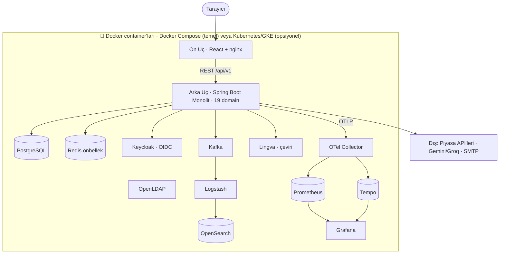
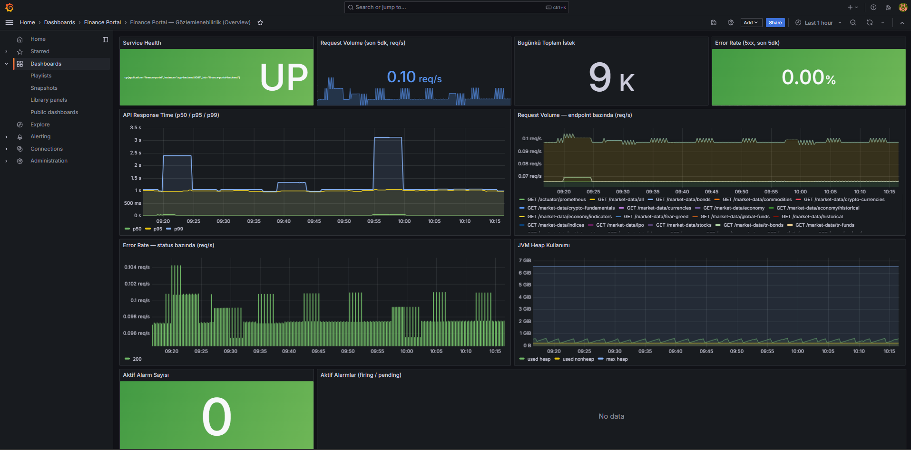
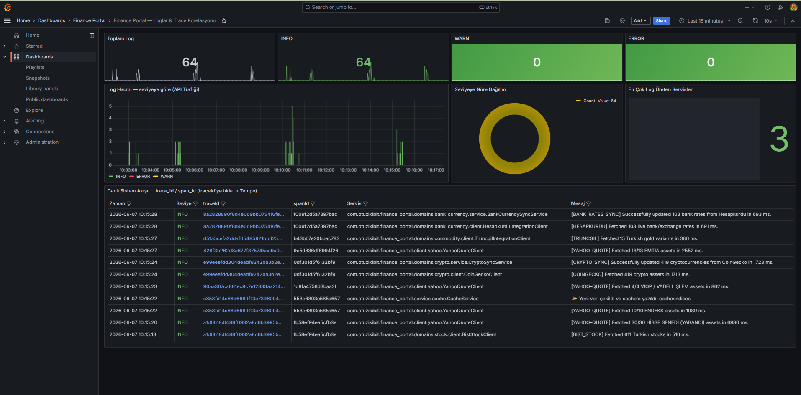
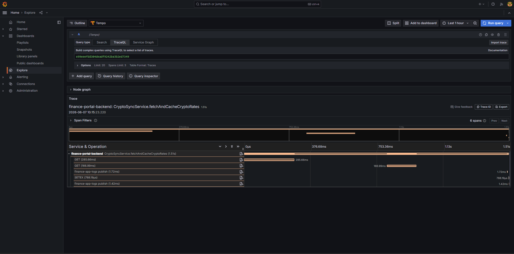
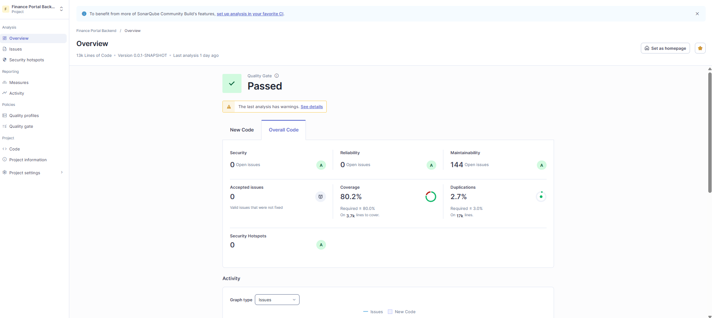
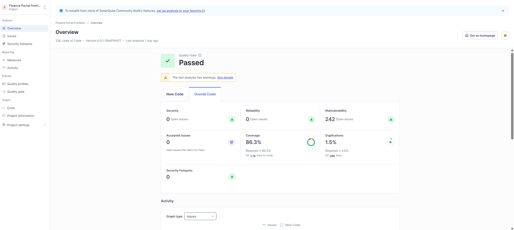

<div align="center">


# 💹 32Bit Finans Portalı

**Full-stack, çok varlık-sınıflı finansal piyasa takip & portföy yönetim platformu**

*Gerçek zamanlı piyasa verileri · Portföy · Fiyat alarmları · What-If simülasyonu · YZ asistanı*


*Toyota & 32Bit Full-Stack Yarışması 2026 için geliştirilmiştir*

[English](README.md) · **Türkçe**

</div>

---

## İçindekiler

1. [Genel Bakış](#genel-bakis)
2. [Özellikler](#ozellikler)
3. [Mimari](#mimari)
4. [Teknoloji Yığını](#teknoloji-yigini)
5. [Başlarken](#baslarken)
6. [Servisler ve Portlar](#servisler-ve-portlar)
7. [Varsayılan Kimlik Bilgileri ve Kullanıcılar](#kimlik-bilgileri)
8. [API Dokümantasyonu](#api-dokumantasyonu)
9. [Kimlik Doğrulama ve Güvenlik](#guvenlik)
10. [Gözlemlenebilirlik](#gozlemlenebilirlik)
11. [Kod Kalitesi](#kod-kalitesi)
12. [Dağıtım](#dagitim)
13. [Proje Yapısı](#proje-yapisi)
14. [Dokümantasyon](#dokumantasyon)
15. [İletişim](#iletisim)
16. [Lisans](#lisans)

---

<a id="genel-bakis"></a>
## Genel Bakış

**32Bit Finans Portalı**, Toyota & 32Bit Full-Stack Yarışması 2026 için geliştirilmiş; full-stack, çok varlık-sınıflı bir finansal **piyasa takip ve kişisel portföy yönetim** web uygulamasıdır.

**19 varlık / veri alanı** genelinde neredeyse gerçek zamanlı veriyi bir araya getirir — döviz, banka & efektif kurları, kripto, emtia, Türk altını, hisseler (+ BİST & küresel endeksler), fonlar (TEFAS & küresel ETF'ler), tahviller, Türk tahvilleri (DİBS), eurobondlar, VİOP, vadeli işlemler, halka arzlar (IPO), Türkiye & ABD ekonomik göstergeleri, ekonomik takvim ve finansal haberler — birçok dış sağlayıcıdan toplar ve *senkronize-et-ve-önbellekle* tasarımıyla düşük gecikmeyle sunar.

Verinin üzerine; **portföy takibi** (TL ve % cinsinden kâr/zarar, dağılım, işlem geçmişi), **izleme listeleri**, **fiyat alarmları** (e-posta), teknik göstergeler ve karşılaştırma içeren **geçmiş grafikler**, **simülasyon & What-If** analizi, bir **YZ asistanı** (kullanıcının kendi verisi üzerinde LLM araç-çağırma) ve **çok dilli (TR/EN)**, **çok temalı** bir arayüz sunar.

- **Backend:** modüler-monolit **Spring Boot** (19 domain modülü), katmanlı mimari.
- **Frontend:** **React** SPA.
- **Kimlik:** **Keycloak** (OIDC, 2FA, rol tabanlı erişim, çok katmanlı ban).
- **Gözlemlenebilirlik:** **OpenTelemetry** (metrik, iz, log) → Prometheus / Tempo / Grafana / OpenSearch.
- **Dağıtım:** yerelde **Docker Compose**, bulutta **Kubernetes (GKE)**.

> ⚠️ **Sorumluluk reddi:** Tüm piyasa verileri yalnızca **bilgilendirme amaçlıdır** ve yatırım tavsiyesi **değildir**.

---

<a id="ozellikler"></a>
## Özellikler

**Piyasa Verileri & Analiz**
- 19 varlık/veri alanı (döviz, banka kurları, kripto, emtia, altın, hisseler + endeksler, fonlar, tahviller, eurobond, VİOP, vadeli, IPO, TR/ABD ekonomisi, ekonomik takvim, haberler)
- Geçmiş fiyat grafikleri (mum/çizgi) + teknik gösterge (hareketli ortalama) + çoklu varlık karşılaştırması
- What-If & kaydedilmiş simülasyon senaryoları
- Kripto Korku & Açgözlülük endeksi, temel veriler (hisse & kripto)

**Kişisel**
- Çoklu (isimli) **portföyler** — güncel değer, kâr/zarar (TL & %), dağılım (pasta grafik), toplam getiri, işlem geçmişi
- **İzleme listesi** (canlı fiyat + mini grafik)
- **Fiyat alarmları** (ÜSTÜNDE/ALTINDA, tek seferlik/sürekli) e-posta bildirimiyle
- **Kaydedilen grafikler** (çizimler/katmanlar)
- **YZ sohbet asistanı** — kullanıcının portföyü/izleme listesi/alarmları/fiyatları üzerinde LLM araç-çağırma

**Platform**
- **TR ↔ EN çeviri** ile haberler (kendi sunucumuzda Lingva)
- **Kimlik doğrulama & yetkilendirme** — Keycloak/OIDC, JWT, **2FA (TOTP)**, USER/ADMIN rolleri, **çok katmanlı ban**
- **Çoklu dil** (TR/EN) ve **çoklu tema** arayüz
- **Dayanıklılık** — zamanlanmış senkron + Redis önbellek + son-iyi-değer/yedek değerler; LLM sağlayıcı yük devretme
- **Gözlemlenebilirlik** — metrik, iz, log (OpenTelemetry)
- **REST API** — `/api/v1` sürümleme, **OpenAPI/Swagger** & **Javadoc**, merkezî hata yönetimi
- **Yönetim paneli** — kullanıcı yönetimi, ban, oturum sonlandırma

---

<a id="mimari"></a>
## Mimari

Her bileşen bir **Docker container'ı** olarak paketlenir — tüm yığın tek bir `docker compose up` ile çalışır (temel/baseline dağıtım). **Kubernetes/GKE, isteğe bağlı bir production dağıtımıdır** ve ek olarak Ingress + TLS (cert-manager) ve yatay otomatik ölçekleme (HPA) sağlar. Backend modüler-monolit bir Spring Boot uygulamasıdır; piyasa verileri zamanlanmış işlerle dış sağlayıcılardan toplanır ve bir Redis önbelleğinden sunulur.



> Ayrıntılı mimari (C4 seviyeleri, bileşenler, veri modeli) **[Teknik Tasarım Dokümanı (PDF)](docs/32_BIT_FinansPortal_TeknikAnalizDokumanı.pdf)** içindedir.

---

<a id="teknoloji-yigini"></a>
## Teknoloji Yığını

| Katman | Teknolojiler |
|--------|--------------|
| **Ön Uç (Frontend)** | React 19, Vite, React Router, TanStack React Query, Axios, Tailwind CSS, i18next, KLineCharts / Lightweight-Charts / Recharts, Vitest |
| **Arka Uç (Backend)** | Java 21, Spring Boot 3.3 (Web, Data JPA, Security, OAuth2 Resource Server, Data Redis, Data LDAP, Data Elasticsearch, Mail), Flyway, MapStruct, Lombok, Log4j2, springdoc-openapi, Micrometer, jsoup |
| **Veri & Altyapı** | PostgreSQL, Redis, Apache Kafka (+ Zookeeper), OpenSearch, Logstash, Keycloak (OIDC), OpenLDAP |
| **Gözlemlenebilirlik** | OpenTelemetry (Java Agent), Prometheus, Tempo, Grafana |
| **YZ & Çeviri** | Google Gemini, Groq (LLM), Lingva (kendi sunucumuzda çeviri) |
| **DevOps & Kalite** | Docker, Docker Compose, Kubernetes (GKE), cert-manager, GitHub Actions, SonarQube, JaCoCo, k6 |

---

<a id="baslarken"></a>
## Başlarken

Tüm yığın (backend + frontend + tüm altyapı) tek bir Docker Compose komutuyla çalışır. Backend ve frontend imajları kendi Dockerfile'larından **yerelde derlenir**.

### Önkoşullar

- **Docker** & **Docker Compose**
- **JDK 21** (yalnızca Keycloak ban-authenticator eklentisini bir kez derlemek için)
- *(opsiyonel)* **Node.js 20+** — sadece frontend'i Docker dışında dev modunda çalıştırmak istersen
- **Kaynak:** ~17 container çalışır (OpenSearch & Kafka dahil) — Docker'a **≥ 8 GB RAM** ve **~40 GB boş disk** ayır (Docker Desktop → Settings → Resources)

### Hızlı Başlangıç

```bash
# 1. Klonla
git clone <repo-url>
cd finance_portal

# 2. Keycloak ban-authenticator eklentisini derle (tek seferlik)
#    Linux/macOS: "Permission denied" alırsan önce `chmod +x mvnw`
./mvnw -f keycloak-providers/ban-authenticator/pom.xml package

# 3. (Opsiyonel) API anahtarları için .env oluştur — aşağıdaki "Yapılandırma"ya bak
#    Olmadan da çalışır; veri senkronu / YZ / e-posta özellikleri zarif şekilde devre dışı kalır.

# 4. Tüm yığını başlat (backend + frontend build edilir, tüm servisler ayağa kalkar)
docker compose up -d

# 5. Uygulamayı aç
#    Ön Uç  : http://localhost:5173
#    Arka Uç: http://localhost:8081/api/v1
#    Swagger: http://localhost:8081/api/v1/swagger-ui.html
```

### Keycloak Realm (otomatik içe aktarılır)

Keycloak realm'i `finance-realm` — roller, hazır kullanıcılar ve **ban-check giriş akışı** dahil — ilk açılışta **otomatik içe aktarılır**. Docker Compose, Keycloak'ı `--import-realm` ile çalıştırır ve repodaki temizlenmiş realm dosyasını ([`finance_portal/finance-realm.json`](finance_portal/finance-realm.json) — private key/SMTP yok; Keycloak imza anahtarlarını import'ta kendisi üretir) mount eder; ban-authenticator eklentisi (2. adımda derlenir) yüklendiği için giriş-akışı bağlaması çözülür. **Manuel adım gerekmez.**

<details>
<summary><b>Alternatif — manuel içe aktarma</b> (konsolu tercih edersen veya otomatik import'u kapattıysan)</summary>

1. Keycloak admin konsolunu aç: http://localhost:8080 (`admin` / `admin`).
2. **Create realm → Import** ile [`finance_portal/finance-realm.json`](finance_portal/finance-realm.json) dosyasını içe aktar.
3. **Authentication → browser flow** içinde **"Ban Check (Finance Portal)"** adımını OTP'den *önce* ekle; böylece banlı kullanıcılar girişte engellenir.

</details>

### Yapılandırma (`.env`)

Dış entegrasyonları etkinleştirmek için `finance_portal/.env` oluştur. **Tüm anahtarlar opsiyoneldir** — eksik olanlar yalnızca kendi özelliğini devre dışı bırakır (çekirdek uygulama çalışmaya devam eder):

```env
# Piyasa verileri
EVDS_API_KEY=          # TCMB EVDS (döviz & ekonomi geçmişi)
FRED_API_KEY=          # ABD ekonomik verisi (TÜFE)
FMP_API_KEY=           # Financial Modeling Prep
FINNHUB_API_KEY=       # Ekonomik takvim

# YZ asistanı (sohbet) — Gemini birincil, Groq yedek
GEMINI_API_KEY=
GROQ_API_KEY=

# E-posta (fiyat alarmı bildirimleri)
MAIL_USERNAME=
MAIL_PASSWORD=

# Yığını durdurmak için
# docker compose down
```

> Her şeyi durdurmak için: `docker compose down` (veri volume'larını da silmek için `-v` ekle).

### Sorun Giderme

| Belirti | Çözüm |
|---------|-------|
| `./mvnw: Permission denied` (Linux/macOS) | `chmod +x mvnw` çalıştır, sonra tekrar dene |
| Bir container (genelde **OpenSearch**) **ilk** `up`'ta `unhealthy` | Yük altında geçici başlangıç-zamanlaması — sadece `docker compose up -d`'yi tekrar çalıştır (kalanları ayağa kaldırır). Linux'ta OpenSearch ısrarla düşerse: `sudo sysctl -w vm.max_map_count=262144` sonra tekrar dene |
| Başlangıçtan hemen sonra bir servis hazır değil | İlk açılış ~1-2 dk sürer (DB migration + bağlantılar). Bekle, sonra `curl http://localhost:8081/api/v1/actuator/health` → `{"status":"UP"}` |
| Container'lar çöküyor / OOM | Docker'a daha çok bellek ver (**≥ 8 GB**) — OpenSearch & Kafka bellek yer |
| Temiz başlangıç / Keycloak realm yeniden import | `docker compose down -v` sonra `docker compose up -d` (volume'ları siler, taze DB'de realm yeniden import edilir) |
| YZ sohbet / e-posta / bazı ekonomi verileri boş | `.env` olmadan **beklenen** — bunlar API anahtarı ister; uygulamanın geri kalanı normal çalışır |
| Grafana panoları boş / görünmüyor | **Finance Portal** klasöründeler — `admin`/`admin` ile giriş yap, ya da `docker compose restart grafana` (ilk açılışta SQLite kilidi) |

---

<a id="servisler-ve-portlar"></a>
## Servisler ve Portlar

Tüm servisler `docker compose` ile çalışır. Varsayılan giriş bilgileri [Varsayılan Kimlik Bilgileri ve Kullanıcılar](#kimlik-bilgileri) bölümündedir.

| Servis | Port(lar) | URL / Erişim |
|--------|-----------|--------------|
| **Ön Uç** (React + nginx) | `5173` | http://localhost:5173 |
| **Arka Uç** (Spring Boot REST API) | `8081` | http://localhost:8081/api/v1 |
| **Swagger UI** (API dokümanı) | `8081` | http://localhost:8081/api/v1/swagger-ui.html |
| **Keycloak** (kimlik / OIDC) | `8080` | http://localhost:8080 |
| **PostgreSQL** (veritabanı) | `5432` | `finance_db` |
| **Redis** (önbellek) | `6379` | — |
| **Apache Kafka** | `9092` | — |
| **Zookeeper** | `2181` | — |
| **OpenSearch** (log deposu) | `9200`, `9600` | http://localhost:9200 |
| **OpenSearch Dashboards** | `5601` | http://localhost:5601 |
| **Logstash** (log boru hattı) | *(dahili)* | — |
| **Lingva** (çeviri) | `5050` | http://localhost:5050 |
| **OpenLDAP** | `1389` | — |
| **phpLDAPadmin** | `8082` | http://localhost:8082 |
| **OpenTelemetry Collector** | `4317` (gRPC), `4318` (HTTP), `8889` | — |
| **Tempo** (izler) | `3200` | — |
| **Prometheus** (metrikler) | `9090` | http://localhost:9090 |
| **Grafana** (panolar) | `3000` | http://localhost:3000 |
| **SonarQube** (kod kalitesi) | `9000` | http://localhost:9000 — `docker compose --profile sonar up -d sonarqube` ile başlat |

---

<a id="kimlik-bilgileri"></a>
## Varsayılan Kimlik Bilgileri ve Kullanıcılar

> ⚠️ Bunlar yalnızca değerlendirme için **yerel/demo varsayılanlarıdır** — gerçek bir dağıtımda değiştir.

### Uygulama Kullanıcıları (Keycloak)

Uygulamadan (http://localhost:5173 → Giriş) hazır realm kullanıcılarından biriyle giriş yap:

| Kullanıcı adı | Şifre | Rol | Notlar |
|---------------|-------|-----|--------|
| `superadmin` | `superadmin` | **ADMIN** | Tam erişim + yönetim paneli (kullanıcı yönetimi, ban, oturum sonlandırma) |
| `demouser` | `test123` | USER | Standart kullanıcı (portföy, izleme listesi, alarmlar, simülasyon, YZ sohbet) |
| `financeuser` | `finance123` | USER | **2FA** demosu — ilk girişte TOTP kurulumu ister |

### Altyapı / Yönetim Konsolları

| Servis | URL | Kullanıcı adı | Şifre |
|--------|-----|---------------|-------|
| Keycloak admin | http://localhost:8080 | `admin` | `admin` |
| Grafana | http://localhost:3000 | `admin` | `admin` |
| SonarQube | http://localhost:9000 | `admin` | `admin` |
| PostgreSQL | `localhost:5432` (db `finance_db`) | `finance_user` | `finance_password` |

---

<a id="api-dokumantasyonu"></a>
## API Dokümantasyonu

Tüm REST uçları `/api/v1` öneki altında sunulur, JSON döner ve (korumalı olanlar) bir `Authorization: Bearer <JWT>` başlığı ister. Hatalar tek ve tutarlı bir `ErrorResponse` yapısı kullanır.

- **OpenAPI / Swagger UI:** http://localhost:8081/api/v1/swagger-ui.html
- **OpenAPI şeması (JSON):** http://localhost:8081/api/v1/v3/api-docs
- **Javadoc:** `./mvnw javadoc:javadoc` (`finance_portal/` içinden) → `target/site/apidocs/index.html`

### Uç Grupları

| Temel yol | Alan | Erişim |
|-----------|------|--------|
| `/market-data/**` | Piyasa verileri — döviz, kripto, emtia, hisse, fon, tahvil, VİOP, vadeli, IPO, ekonomi… | Herkese açık |
| `/analysis/**`, `/market-data/historical` | Geçmiş fiyat serisi + hareketli ortalama | Herkese açık |
| `/interest/**` | Mevduat getiri hesaplayıcı | Herkese açık |
| `/economic-calendar`, `/news/**` | Ekonomik takvim & haberler | Herkese açık |
| `/portfolio/**` | Portföy yönetimi (K/Z, dağılım, işlemler) | USER |
| `/watchlist/**` | İzleme listesi | USER |
| `/alarms/**` | Fiyat alarmları | USER |
| `/simulation/**`, `/what-if/**` | Simülasyon & What-If | USER |
| `/charts/**` | Kaydedilen grafikler | USER |
| `/chat/**` | YZ asistanı | USER |
| `/users/me/**` | Profil, 2FA, tercihler | USER |
| `/admin/**` | Kullanıcı yönetimi, ban, oturum sonlandırma | ADMIN |

> Tam istek/yanıt ayrıntıları yukarıdaki **Swagger UI**'da; gereksinim düzeyindeki tam katalog **[Analiz Dokümanı (PDF)](docs/32_BIT_FinansPortal_AnalizDokumanı.pdf)** içindedir.

---

<a id="guvenlik"></a>
## Kimlik Doğrulama ve Güvenlik

Kimlik **Keycloak**'a (OIDC) devredilir. Frontend, Authorization Code akışıyla bir JWT alır; backend **OAuth2 Resource Server** olarak davranır ve token'ı her istekte doğrular.

- **Token'lar:** JWT (access / refresh / id); principal = `preferred_username`
- **Roller:** `USER`, `ADMIN` (`realm_access.roles` → `ROLE_*`); URL kuralları + `@PreAuthorize` ile uygulanır
- **2FA:** Keycloak üzerinden TOTP; **Beni hatırla** desteklenir
- **Çok katmanlı ban** — banlı kullanıcı dört seviyede engellenir:
  1. **Keycloak SPI** (`BanCheckAuthenticator`) — girişte, 2FA adımından *önce*
  2. **`UserBanFilter`** — her API isteğinde → `403`
  3. **`SessionRevocationFilter`** — admin oturum-sonlandırmasından önce üretilmiş token'ları reddeder
  4. **`BanExpiryJob`** — süresi dolan geçici banları otomatik kaldırır
- **Taşıma & sertleştirme:** production'da HTTPS/TLS (cert-manager); CORS yalnızca tanımlı origin'lerle sınırlı (`*` yok); secret'lar env / Kubernetes Secret ile; YZ-sohbet hız sınırlama; Bean Validation (`@Valid`); sahiplik (IDOR) kontrolleri → `403`

> Tehdit modeli (STRIDE) ve OWASP ASVS eşlemesi **[Teknik Tasarım Dokümanı (PDF)](docs/32_BIT_FinansPortal_TeknikAnalizDokumanı.pdf)** içindedir.

---

<a id="gozlemlenebilirlik"></a>
## Gözlemlenebilirlik

Üç sütunlu, tam **OpenTelemetry** tabanlı gözlemlenebilirlik:

| Sütun | Boru hattı |
|-------|------------|
| **Metrikler** | Micrometer → `/actuator/prometheus` → **Prometheus** → **Grafana** |
| **İzler (Traces)** | OpenTelemetry Java Agent → OTel Collector → **Tempo** → **Grafana** |
| **Loglar** | Log4j2 (JSON) → **Kafka** → **Logstash** → **OpenSearch** → OpenSearch Dashboards |

**Panolar:** Grafana → http://localhost:3000 (önceden yüklü panolar **Finance Portal** klasöründe) · OpenSearch Dashboards → http://localhost:5601

> Grafana pano listesi boş görünüyorsa `admin` / `admin` ile giriş yap (veya `docker compose restart grafana`).

<div align="center">
  
  <br/><em>Genel Bakış: Servis Sağlığı, API Yanıt Süresi (p50/p95/p99), İstek Hacmi, Hata Oranı, JVM Heap, Aktif Alarmlar</em>
  <br/><br/>
  
  <br/><em>Loglar &amp; İz Korelasyonu: log seviyeleri, en çok log üreten servisler, trace_id/span_id</em>
  <br/><br/>
  
  <br/><em>Tempo'da dağıtık izleme: tek bir isteğin uçtan uca span'leri (ör. kripto veri senkronu)</em>
</div>

---

<a id="kod-kalitesi"></a>
## Kod Kalitesi

Kod kalitesi ve test kapsamı **SonarQube** + **JaCoCo** ile ölçülür.

```bash
# Testler + kapsam (JaCoCo raporu target/site/jacoco/ altında)
./mvnw verify

# SonarQube ile statik analiz
docker compose --profile sonar up -d sonarqube      # SonarQube'u başlat (http://localhost:9000)
./mvnw -Psonar                                       # analiz et & sonuçları gönder
```

<div align="center">
  
  <br/><em>Backend — SonarQube Quality Gate (kapsam, hatalar, güvenlik açıkları, kod kokuları, tekrarlar)</em>
  <br/><br/>
  
  <br/><em>Frontend — SonarQube Quality Gate</em>
</div>

---

<a id="dagitim"></a>
## Dağıtım

| Hedef | Nasıl |
|-------|-------|
| **Yerel** | `docker compose up -d` ([Başlarken](#baslarken)'e bak) — tek makinede tüm yığın |
| **Bulut (Kubernetes / GKE)** | `k8s/` altında katmanlı manifestler (namespace → data → messaging → auth → app → observability → scaling → network), **cert-manager** ile TLS |
| **Tek komutla bulut açılışı** | `scripts/open-cluster.ps1` (kapatmak için `scripts/close-cluster.ps1`) |

**CI/CD (GitHub Actions):**
- **CI** (`.github/workflows/ci-cd.yml`) — her push/PR'da: `mvn verify` (derleme + birim + entegrasyon + JaCoCo) + Docker Compose config kontrolü.
- **CD** (`.github/workflows/deploy-to-gke.yml`) — backend & frontend imajlarını **git SHA** etiketiyle derler, **Artifact Registry**'e push eder ve **GKE**'de rolling update yapar.

---

<a id="proje-yapisi"></a>
## Proje Yapısı

```
.
├── finance_portal/                 # Backend — Spring Boot (Java 21), 19 domain modülü
│   ├── src/                        # uygulama kodu, Flyway migration'ları, Log4j2 config
│   ├── keycloak-providers/         # Keycloak ban-authenticator (SPI)
│   ├── keycloak-themes/            # özel Keycloak giriş temaları
│   ├── observability/              # OTel Collector / Tempo / Prometheus / Grafana configleri
│   ├── docker-compose.yml          # tam yerel yığın (uygulama + altyapı)
│   ├── finance-realm.json          # Keycloak realm (temizlenmiş; otomatik içe aktarılır)
│   └── Dockerfile
├── finance-frontend/               # Frontend — React 19 + Vite
│   ├── src/                        # sayfalar, bileşenler, hook'lar, context, i18n
│   └── Dockerfile
├── k8s/                            # Kubernetes manifestleri (katmanlı)
├── docs/                           # Analiz & Teknik Tasarım dokümanları (PDF)
├── scripts/                        # open-cluster.ps1 / close-cluster.ps1
├── assets/                         # README görselleri
├── .github/workflows/              # GitHub Actions (CI/CD)
├── README.md
└── LICENSE
```

---

<a id="dokumantasyon"></a>
## Dokümantasyon

| Doküman | Açıklama |
|---------|----------|
| 📘 [Analiz Dokümanı (SRS)](docs/32_BIT_FinansPortal_AnalizDokumanı.pdf) | Yazılım Gereksinim Spesifikasyonu — fonksiyonel & fonksiyonel olmayan gereksinimler (ISO/IEC/IEEE 29148, ISO/IEC 25010) |
| 📗 [Teknik Tasarım Dokümanı (SDD)](docs/32_BIT_FinansPortal_TeknikAnalizDokumanı.pdf) | Yazılım Tasarım Tanımı — mimari, veri modeli, API, güvenlik, dağıtım (IEEE 1016, C4, OWASP ASVS) |

---

<a id="iletisim"></a>
## İletişim

**Türkbey Yozçu**

- 📧 turkbey.yozcu@gmail.com
- 💼 [LinkedIn](https://www.linkedin.com/in/t%C3%BCrkbey-yoz%C3%A7u/)

---

<a id="lisans"></a>
## Lisans

Bu proje **MIT Lisansı** ile lisanslanmıştır — ayrıntılar için [LICENSE](LICENSE) dosyasına bakın.

© 2026 Türkbey Yozçu
