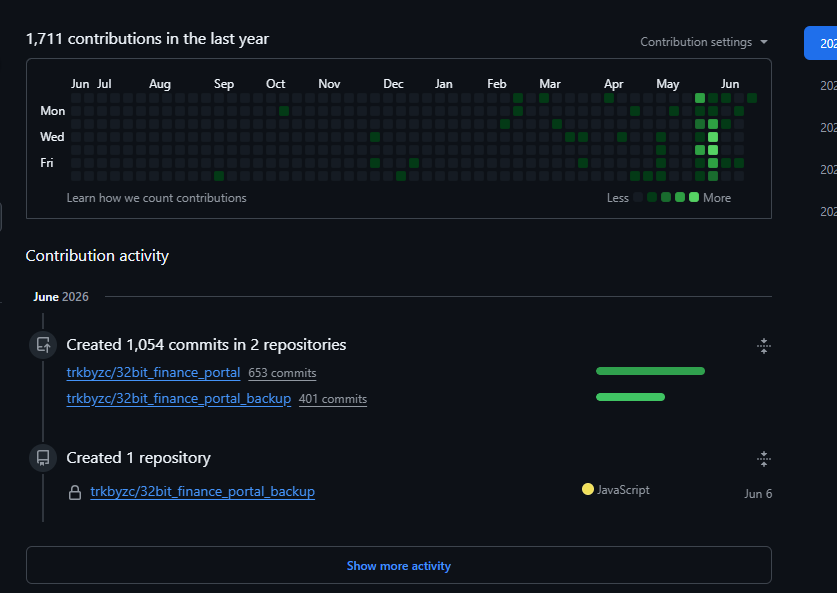
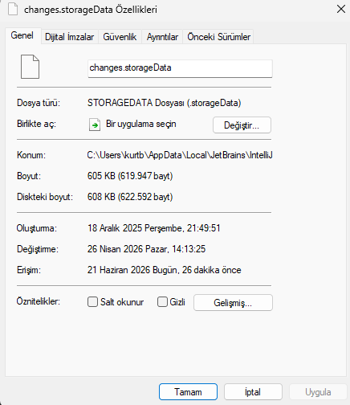
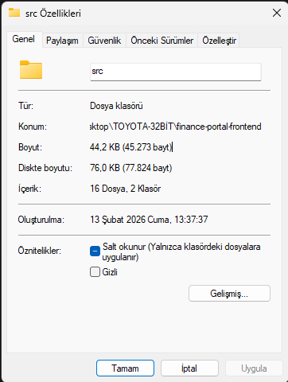
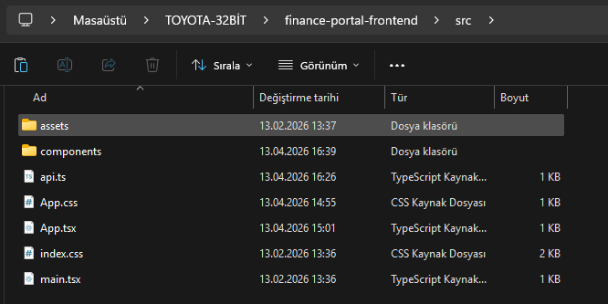
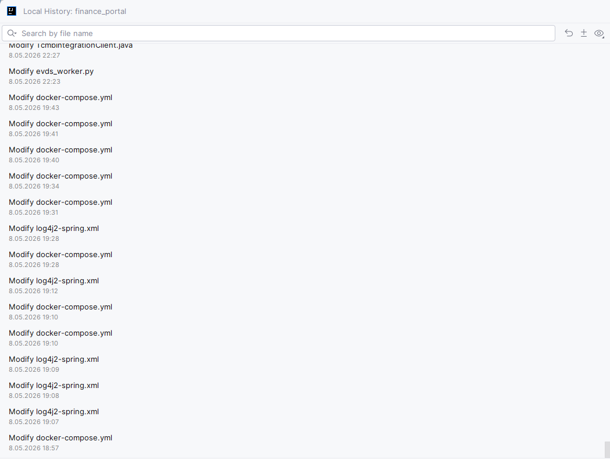
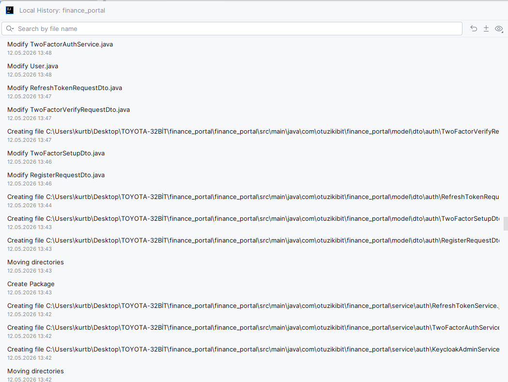
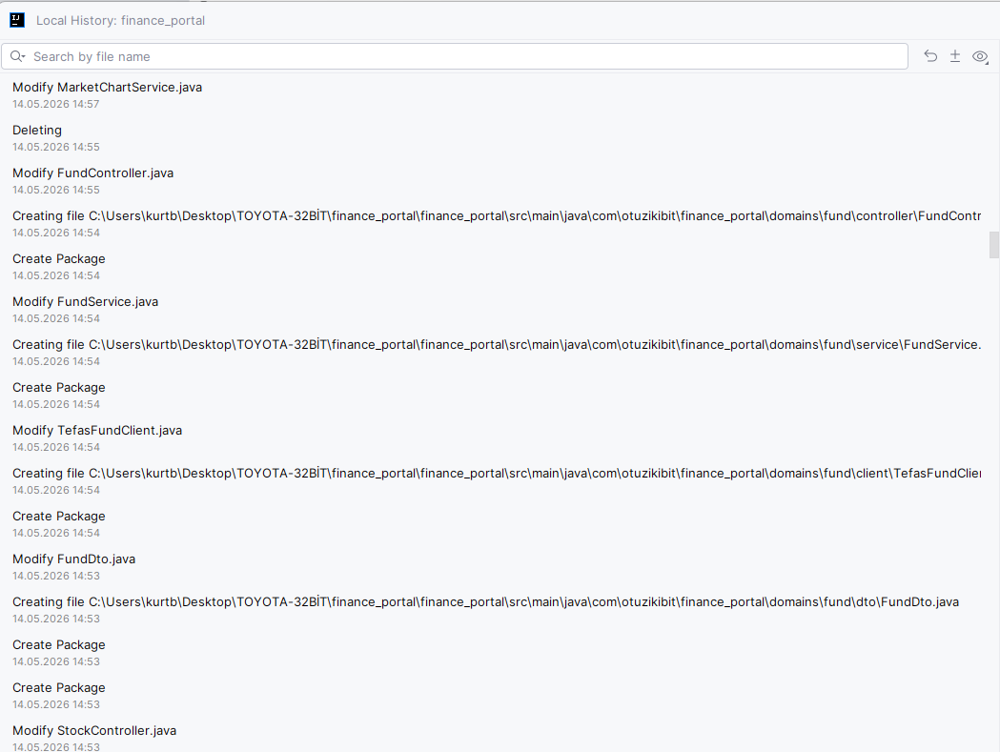
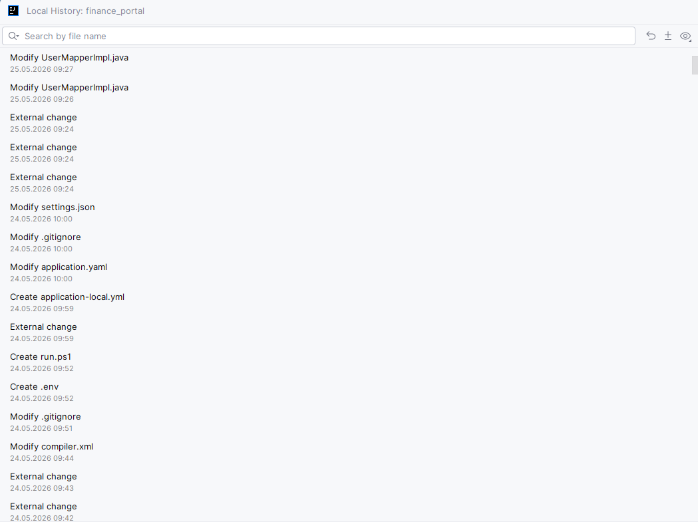

# Finance Portal — Geliştirme Zaman Çizelgesi (Development Timeline)

Bu belge, Finance Portal projesinin gerçek geliştirme sürecini sistemin otantik
kayıtlarına dayanarak belgelemektedir. Projede sürüm kontrolü (Git) ilk
aşamalarda birincil araç olarak kullanılmamış; erken geliştirme **IntelliJ IDEA**
ortamında, IDE'nin **Local History** mekanizması altında yürütülmüştür. Git,
birincil sürüm kontrol sistemi olarak **24 Mayıs 2026**'dan itibaren düzenli
biçimde kullanılmaya başlanmıştır. Bu nedenle commit geçmişi Mayıs–Haziran 2026
döneminde yoğunlaşmaktadır.

Aşağıda, projenin **Aralık 2025**'ten itibaren süregelen geliştirme sürecini
gösteren, elle değiştirilemeyen sistem kayıtları sunulmaktadır. Tüm bulgular,
§6'daki adımlarla bağımsız olarak doğrulanabilir.

Git commit geçmişinin yoğunluk dağılımı (bağlam):

---

## 1. Sistem Kanıtı: Proje Aralık 2025 – Nisan 2026 Arasında Mevcuttu

### 1.1 IntelliJ Local History deposu — 18 Aralık 2025
IntelliJ IDEA, üzerinde çalışılan dosyaların anlık görüntülerini, kullanıcı
tarafından elle düzenlenemeyen bir sistem deposunda (`changes.storageData`)
otomatik olarak tutar. Bu projeye ait depo **18 Aralık 2025** tarihinde
oluşturulmuş ve en son **26 Nisan 2026** tarihinde yazılmıştır:

### 1.2 Frontend katmanı — 13 Şubat 2026
Erken dönemin TypeScript tabanlı frontend kaynakları diskte korunmaktadır.
`finance-portal-frontend/src` klasörü **13 Şubat 2026** tarihinde oluşturulmuştur:

Klasör içindeki `.tsx` / `.ts` dosyalarının tarihleri **13 Şubat – 13 Nisan 2026**
aralığındadır. (Erken dönem frontend TypeScript ile geliştirilmiş, ileride `.jsx`
yapısına yeniden yazılmıştır.)

---

## 2. Günlük Geliştirme Kaydı: 8–25 Mayıs 2026 (IntelliJ Local History)

IntelliJ Local History arayüzü, Git öncesi son dönemde projenin **günlük**
değişikliklerini saat hassasiyetinde kaydetmiştir. Bu kayıtlar, düzenli Git
kullanımının başladığı 24 Mayıs'tan önce projenin ulaştığı olgunluğu
göstermektedir. Temsilî örnekler:

**8 Mayıs** — Docker Compose yapılandırması, log4j2 loglama, TCMB entegrasyon
istemcisi, EVDS veri işleyicisi:

**12 Mayıs** — Clean-architecture yapısına geçiş ("Create Package", "Moving
directories") ve kimlik/2FA katmanı (`TwoFactorAuthService`, `KeycloakAdminService`):

**14 Mayıs** — `domains/fund` clean-architecture yapısı (`FundController`,
`FundService`, `FundDto`, `TefasFundClient`):

**24 Mayıs** — `.env`, `run.ps1`, `.gitignore`, `application-local.yml`
dosyalarının oluşturulması; yani Git tabanlı geliştirme ortamının kurulduğu an:

8–25 Mayıs arasındaki **günlük** Local History kayıtlarının tamamı `docs/timeline/`
klasöründe yer almaktadır (`localhistory-may08` … `localhistory-may24-git-transition`).
Bu kayıtlar 9, 10, 11, 13, 18, 19 ve 20 Mayıs günlerini de kapsar; portfolyo
servisleri, `domains/turkish_bond` · `domains/deposit` · `domains/economy`
yapıları ve grafik (chart) strateji katmanları bu dönemde geliştirilmiştir.

---

## 3. Çapraz Doğrulama

Birbirinden bağımsız iki sistem kaydı, Git tabanlı akışa geçiş tarihini tutarlı
biçimde işaret etmektedir:

- **IntelliJ Local History**'de kayıtlı son değişiklik: **25 Mayıs 2026, 09:27**.
  Bu tarihten sonra IDE üzerinde değişiklik kaydı bulunmamaktadır.
- **Git**'te düzenli commit kadansının başlangıcı: **24 Mayıs 2026**
  (Mayıs: 133 commit, Haziran: 252 commit).

Buna göre geliştirme ortamının IntelliJ IDEA'dan Git tabanlı akışa geçişi
24 Mayıs 2026'da gerçekleşmiştir: IntelliJ kayıtları bu tarihte sona ermekte,
Git kayıtları aynı tarihte başlamaktadır. Her iki kayıt da elle düzenlenemediği
için, bu örtüşme geliştirme sürecinin sürekliliğini bağımsız olarak doğrular.

---

## 4. Faz Faz Özet

| Faz | Dönem | Yapılanlar | Kaynak |
|---|---|---|---|
| **0 — Temel** | Şubat 2026 | Maven + Spring Boot iskeleti, ilk domain modelleri; frontend (TypeScript) 13 Şubat'ta oluşturuldu | Explorer + LH deposu |
| **1 — Çekirdek backend + ilk frontend** | Şubat–Nisan 2026 | Katmanlı backend (User/Account/Currency/Crypto/Bist/News/Analysis), React+TS frontend (Dashboard, MarketData, News, CurrencyConverter), SQL şeması | LH deposu + dosya tarihleri |
| **2 — Yeniden mimari** | Mayıs 2026 (8–24) | Clean-architecture'a geçiş (`domains/*`), kimlik/2FA/Keycloak, portfolyo servisleri, grafik stratejileri, frontend `.tsx → .jsx` | LH arayüzü (8–25 May) |
| **3 — Git'e geçiş** | 24 Mayıs 2026 | Git tabanlı ortam kurulumu (`.env`, `run.ps1`, `.gitignore`), düzenli commit'leme başlangıcı | LH + git |
| **4 — Teslim & production** | Mayıs–Haziran 2026 | Gözlemlenebilirlik (OpenTelemetry), gerçekçi tahvil/eurobond/VİOP al-sat, i18n (TR/EN), bulut dağıtımı (GKE + HTTPS), dökümantasyon ve sunum | git (Haz: 252 commit) |

Git özeti: **395 commit**, **2026-02-10 → 2026-06-21**; düzenli kadans 24 Mayıs.

---

## 5. Mimari Evrim

Aşağıdaki yapısal değişiklikler, projenin tek seferde değil, zaman içinde
olgunlaşarak geliştirildiğini göstermektedir:

1. **Klasör adı:** `finance-portal` (erken) → `finance_portal` (güncel).
2. **Backend mimarisi:** klasik katmanlı (`controller/service/repository`) →
   clean-architecture (`domains/*`).
3. **Frontend dili:** TypeScript (`.tsx`, 13 Şubat) → `.jsx` (Mayıs).

---

## 6. Doğrulama Adımları

Bu belgedeki bulgular aşağıdaki adımlarla bağımsız olarak kontrol edilebilir:

1. **IntelliJ Local History:** Proje IntelliJ IDEA 2025.3 ile açılır → Project
   panelinde kök klasöre sağ tıklanır → **Local History → Show History**.
   8 Mayıs'a kadar giden saat hassasiyetindeki değişiklik kaydı görüntülenir.
2. **Local History deposunun tarihi:**
   `%LOCALAPPDATA%\JetBrains\IntelliJIdea2025.3\LocalHistory\changes.storageData`
   → Özellikler → Oluşturma **18.12.2025**, Değiştirme **26.04.2026**.
3. **Frontend dosya tarihleri:**
   `…\TOYOTA-32BİT\finance-portal-frontend\src` → Ayrıntılar görünümü → `.tsx`
   dosyaları **13.02.2026 – 13.04.2026**.
4. **Git geçmişi:** `git log --reverse --date=iso --pretty="%ad %s"` — ilk
   commit 2026-02-10, düzenli kadans 24 Mayıs.

---

*Bu belge, geliştirme sürecini şeffaf ve doğrulanabilir biçimde belgelemek
amacıyla hazırlanmıştır. Commit zaman damgaları değiştirilmemiş; geliştirme
geçmişi, sistemde mevcut olan otantik kayıtlara dayanılarak açıklanmıştır.*
